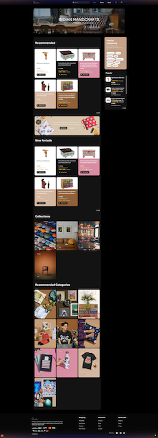
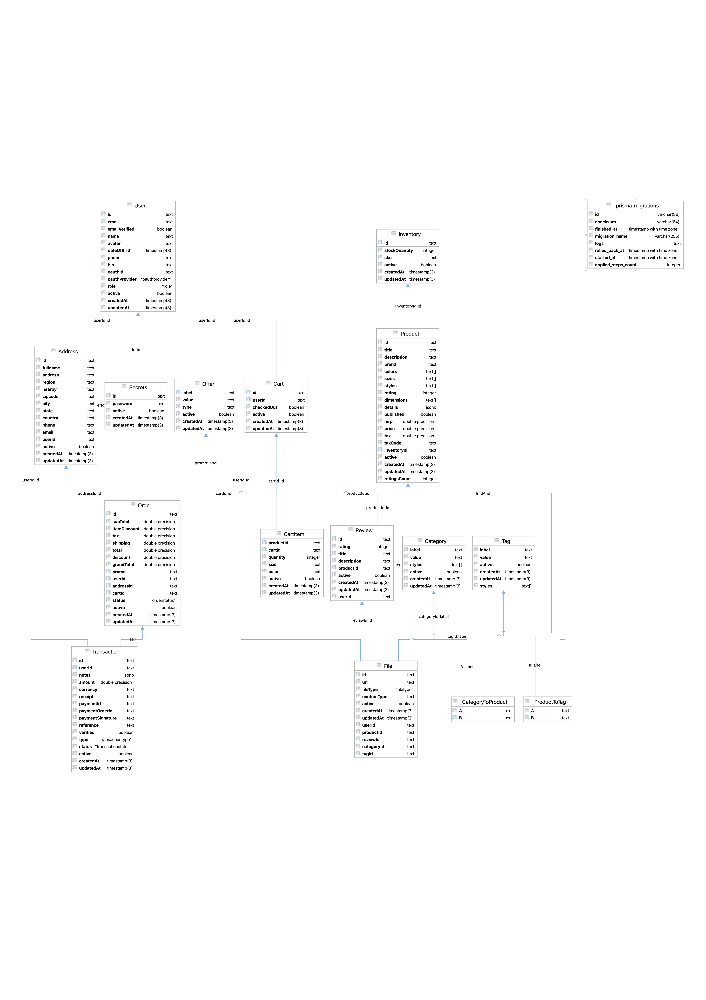

  

  

  

---

## Features

| Codebase                              |   Description    |
| :------------------------------------ | :--------------: |
| [soda](./packages/soda)               |    NodeJS API    |
| [mint](./packages/mint)               | Next.js frontend |
| [maze](./packages/maze)               |   Next.js cms    |
| [rock](./packages/mint/src/libs/rock) |    API Client    |

---

| Branch Name        |    Description     |
| :----------------- | :----------------: |
| [main](main)       | production version |
| [develop](develop) |   Staging branch   |

### db diagram

  

